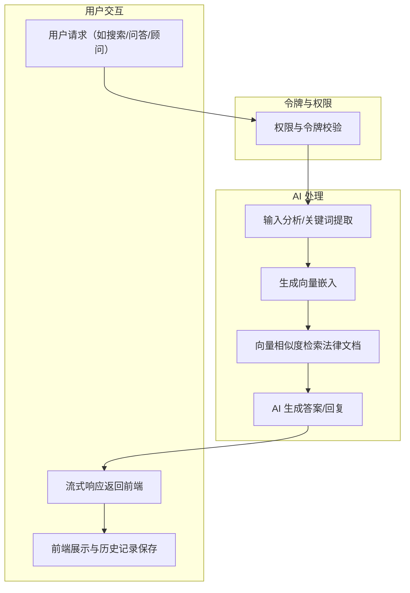

# Macau Law Knowledge Base Web Application

A comprehensive AI-powered legal search, Q&A, and consultation platform for Macau law, built with Next.js, PostgreSQL, and Google Gemini AI.

## Overview of Core Logic / Architecture

### System Architecture

```
┌─────────────────┐    ┌─────────────────┐    ┌─────────────────┐
│   Frontend      │    │   Backend API   │    │   AI Services   │
│   (Next.js)     │◄──►│   (Next.js API) │◄──►│   (Gemini AI)   │
└─────────────────┘    └─────────────────┘    └─────────────────┘
         │                       │                       │
         │                       │                       │
         ▼                       ▼                       ▼
┌─────────────────┐    ┌─────────────────┐    ┌─────────────────┐
│   OIDC Auth     │    │   PostgreSQL    │    │   Embedding     │
│  (Google/GitHub)│    │   (Direct)      │    │   Generation    │
└─────────────────┘    └─────────────────┘    └─────────────────┘
```

### Core Features

1. **Legal Search**: AI-powered vector search through legal documents
2. **Legal Q&A**: Intelligent question-answering based on legal content
3. **Legal Consultant**: Interactive AI chat for legal consultation

### AI Workflow



## Codebase Structure

```
webapp/
├── src/
│   ├── app/                    # Next.js App Router
│   │   ├── layout.tsx          # 根布局
│   │   ├── page.tsx            # 首页
│   │   ├── globals.css         # 全局样式
│   │   ├── auth/               # 认证页面
│   │   │   ├── login/          # 登录页
│   │   │   ├── error/          # 错误页
│   │   │   └── callback/       # OAuth 回调页
│   │   ├── search/             # 法律检索页
│   │   ├── qa/                 # 法律问答页
│   │   ├── consultant/         # 法律顾问对话页
│   │   ├── profile/            # 用户资料页
│   │   ├── db-debug/           # 数据库调试页
│   │   ├── debug/              # 系统调试页
│   │   └── api/                # API 路由
│   │       ├── auth/           # 认证相关 API
│   │       │   ├── [provider]/     # 动态 OAuth 提供商
│   │       │   ├── logout/         # 登出
│   │       │   ├── callback/       # OAuth 回调
│   │       │   │   ├── [provider]/
│   │       │   └── __tests__/      # 认证 API 测试
│   │       ├── search/         # 法律检索 API
│   │       ├── qa/             # 法律问答 API
│   │       ├── consultant/     # 法律顾问 API
│   │       ├── profile/        # 用户资料 API
│   │       │   └── __tests__/
│   │       ├── db-debug/       # 数据库调试 API
│   │       ├── debug-auth/     # 认证调试 API
│   │       └── health/         # 健康检查 API
│   ├── components/             # 可复用 UI 组件
│   ├── contexts/               # React 上下文
│   ├── lib/                    # 核心工具库
│   │   ├── __tests__/              # 工具库测试
│   ├── types/                  # TypeScript 类型定义
│   └── middleware.ts           # 路由中间件
├── tests/                  # Test files
│   ├── setup.ts           # Test configuration
│   ├── db.test.ts         # Database tests
│   ├── auth-service.test.ts # Auth tests
│   ├── gemini.test.ts     # AI service tests
│   └── api-routes.test.ts # API tests
├── scripts/               # Utility scripts
│   ├── migrate.js        # Database migration
│   ├── seed.js           # Test data seeding
│   └── setup-env.js      # Environment setup
├── database-schema.sql   # Database schema
├── package.json          # Dependencies
├── jest.config.js        # Test configuration
├── .env.example          # Environment variables template
└── README.md            # This file
```

## Quick Start Guide

### Prerequisites

- Node.js 18+ and npm
- PostgreSQL 14+ with vector extension
- Google AI API key (for Gemini)
- Google OAuth app (for authentication)
- GitHub OAuth app (for authentication)

### Installation Steps

1. **Clone and Setup**
   ```bash
   cd webapp
   npm install
   ```

2. **Environment Configuration**
   ```bash
   cp .env.example .env.local
   ```
   
   Fill in your environment variables:
   ```env
   # PostgreSQL Configuration
   DATABASE_URL=postgresql://postgres:[password]@[host]:[port]/[database]
   DB_HOST=your-postgres-host
   DB_PORT=5432
   DB_NAME=postgres
   DB_USER=postgres
   DB_PASSWORD=your-password
   DB_SSL=true
   
   # JWT Configuration
   JWT_SECRET=your-jwt-secret-minimum-32-characters
   JWT_EXPIRES_IN=7d
   REFRESH_TOKEN_EXPIRES_IN=30d
   
   # Google OIDC
   GOOGLE_CLIENT_ID=your-google-client-id
   GOOGLE_CLIENT_SECRET=your-google-client-secret
   GOOGLE_REDIRECT_URI=http://localhost:3000/api/auth/callback/google
   
   # GitHub OIDC
   GITHUB_CLIENT_ID=your-github-client-id
   GITHUB_CLIENT_SECRET=your-github-client-secret
   GITHUB_REDIRECT_URI=http://localhost:3000/api/auth/callback/github
   
   # Google Gemini AI
   GEMINI_API_KEY=your-google-ai-api-key
   ```

3. **Database Setup**
   - Execute the SQL in `database-schema.sql` in your PostgreSQL database
   - Ensure the vector extension is installed
   - Run migrations: `npm run db:migrate`
   - (Optional) Add test data: `npm run db:seed`

4. **Authentication Setup**
   - Configure Google OAuth in Google Cloud Console
   - Configure GitHub OAuth in GitHub Developer Settings
   - Add your domain to allowed redirect URLs

5. **Run the Application**
   ```bash
   npm run dev
   ```
   
   The application will be available at `http://localhost:3000`

### How to Run the Application

#### Development Mode
```bash
npm run dev          # Start development server with hot reload
npm run test:watch   # Run tests in watch mode
```

#### Production Mode
```bash
npm run build        # Build for production
npm run start        # Start production server
```

#### Testing
```bash
npm run test         # Run all tests
npm run test:coverage # Run tests with coverage report
npm run type-check   # TypeScript type checking
```

### Common Issues and Troubleshooting

#### Authentication Issues
- **Problem**: OAuth redirect fails
- **Solution**: Check redirect URLs in OAuth provider settings match your domain

#### Database Connection Issues
- **Problem**: Cannot connect to PostgreSQL
- **Solution**: Verify environment variables and check PostgreSQL server status

#### AI API Issues
- **Problem**: Gemini API calls fail
- **Solution**: Verify Google AI API key and check quota limits

#### Vector Search Issues
- **Problem**: Search returns no results
- **Solution**: Ensure documents table has data and embeddings are generated

## User Roles and Permissions

### Admin
- Full access to all features
- Can view all user data and history
- Can manage user roles and token allocations
- Access to admin dashboard

### Free Tier
- 1000 free tokens per month
- Access to Legal Search (with token limits)
- Access to Legal Q&A (with token limits)
- No access to Legal Consultant

### Pay Tier
- 1000 free tokens + paid tokens
- Unlimited Legal Search
- Access to Legal Q&A (with token counting)
- Access to Legal Consultant (with token counting)

### VIP Tier
- Same as Pay Tier
- Access to premium Gemini Pro model in Legal Consultant
- Priority support

## API Endpoints

### Authentication
- `POST /api/auth/[provider]` - Initiate OAuth login
- `GET /api/auth/callback/[provider]` - Handle OAuth callback
- `POST /api/auth/logout` - User logout

### User profile
- `POST /api/profile` - Get user profile


### Legal Search
- `POST /api/search` - Perform legal document search

### Legal Q&A
- `POST /api/qa` - Submit question and get AI answer

### Legal Consultant
- `POST /api/consultant` - Create new conversation

## Security Features

### Authentication & Authorization
- OIDC/OAuth2 with Google and GitHub
- JWT tokens for API authentication
- HTTP-only cookies for session management
- Role-based access control

### Data Protection
- Sensitive data stored server-side only
- API keys and secrets in environment variables
- Input validation and sanitization
- Rate limiting on API endpoints

### Privacy
- User data isolation with database policies
- Secure session management

## Development Guidelines

### Code Quality
- TypeScript for type safety
- ESLint for code linting
- Jest for unit testing
- JSDoc comments for all functions

### Testing Strategy
- Unit tests for all utility functions
- Integration tests for API endpoints
- Component tests for React components
- Minimum 70% code coverage

### Performance Optimization
- Server-side rendering with Next.js
- Vector search for fast document retrieval
- Streaming responses for AI interactions
- Optimized database queries with indexes

## Deployment

### Environment Setup
1. Set up production environment variables
2. Configure PostgreSQL for production
3. Set up domain and SSL certificates
4. Configure OAuth providers for production URLs

### Build and Deploy
```bash
npm run build
npm run start
```

### Monitoring
- Monitor API response times
- Track token usage and costs
- Monitor database performance
- Set up error logging and alerts

## Contributing

1. Fork the repository
2. Create a feature branch
3. Write tests for new functionality
4. Ensure all tests pass
5. Submit a pull request

## License

This project is proprietary software for Macau Law Knowledge Base.

## Support

For technical support or questions, please contact the development team.
